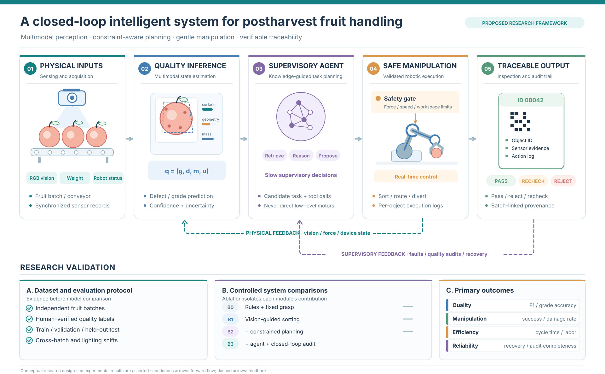

# Postharvest Agent Framework

A conceptual research framework for a **closed-loop intelligent system for postharvest fruit handling** — integrating multimodal perception, constraint-aware planning, gentle robotic manipulation, and verifiable traceability.



> Conceptual research design — no experimental results are asserted.

---

## Overview

The framework is organized as a **five-stage forward pipeline** with **two feedback loops**, so that perception, decision-making, execution, and auditing remain connected end to end.

1. **Physical inputs** — sensing and acquisition (RGB vision, weight, robot status; fruit batch / conveyor; synchronized sensor records).
2. **Quality inference** — multimodal state estimation, producing a per-object quality state `q = (g, d, m, u)` (grade, defect, mass, uncertainty) with confidence.
3. **Supervisory agent** — knowledge-guided task planning (retrieve / reason / propose). Emits candidate tasks and tool calls; **never drives low-level motors directly**.
4. **Safe manipulation** — validated robotic execution behind a safety gate (force / speed / workspace limits), with real-time control and per-object execution logs.
5. **Traceable output** — inspection and audit trail (object ID, sensor evidence, action log; PASS / RECHECK / REJECT; batch-linked provenance).

**Feedback loops**

- **Physical feedback** — vision / force / device state, feeding back into perception.
- **Supervisory feedback** — faults / quality audits / recovery, feeding back into planning.

**Design principle:** slow supervisory decisions, fast safety-gated execution, and a verifiable record for every handled object.

---

## Research validation

The framework is framed around three components that make its claims testable.

**A. Dataset and evaluation protocol** — evidence before model comparison.
Independent fruit batches; human-verified quality labels; train / validation / held-out test; cross-batch and lighting shifts.

**B. Controlled system comparisons** — ablation isolates each module's contribution.

| System | Configuration |
| ------ | ------------- |
| B0 | Rules + fixed grasp |
| B1 | Vision-guided sorting |
| B2 | + constrained planning |
| B3 | + agent + closed-loop audit |

**C. Primary outcomes**

- **Quality** — F1 / grade accuracy
- **Manipulation** — success / damage rate
- **Efficiency** — cycle time / labor
- **Reliability** — recovery / audit completeness

---

## Repository structure

```
postharvest-agent-framework/
├── README.md                         # this file
├── LICENSE
├── .gitignore
├── figures/
│   └── postharvest_agent_framework_en.svg   # framework diagram
└── docs/
    └── framework-overview.md         # detailed notes on modules and validation
```

---

## Status

Conceptual design stage. This repository collects the framework diagram, design notes, and supporting material. No datasets, code, or experimental results are included yet.

## License

Released under the MIT License — see [LICENSE](LICENSE).
